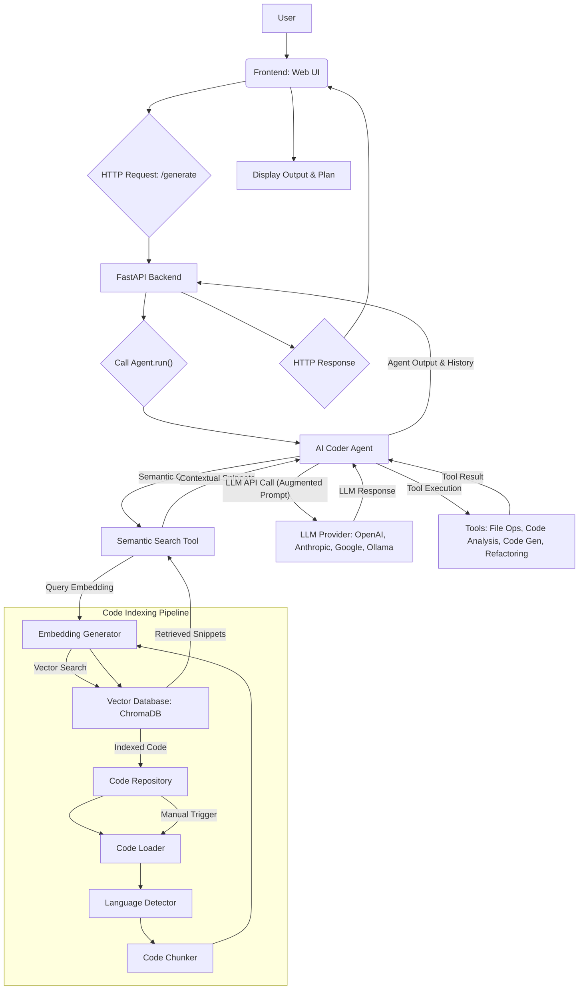

# AI Coder Agent: Enhanced Workflow with RAG and Semantic Search

## System Architecture Overview (Updated)

## Workflow Description (Updated)

The AI Coder Agent now operates with enhanced capabilities, leveraging semantic search and Retrieval-Augmented Generation (RAG) to provide more intelligent and context-aware code assistance.

### 1. Codebase Indexing (Offline/Pre-processing)

Before the agent can utilize semantic search, the codebase needs to be indexed. This is an offline process:

*   **Code Repository (`N`):** The project's code files reside in the repository.
*   **Code Loader (`O`):** The `Code Loader` (`src/code_loader.py`) scans the specified code repository, identifying and listing all relevant code files.
*   **Language Detector (`P`):** For each identified file, the `Language Detector` (integrated within `src/code_loader.py` using `pygments`) determines its programming language.
*   **Code Chunker (`Q`):** The `Code Chunker` (`src/code_chunker.py`) breaks down each code file into semantically meaningful chunks (e.g., functions, classes, logical blocks). This is currently implemented for Python and will be extended for other languages.
*   **Embedding Generator (`H`):** The `Embedding Generator` (`src/embedding_generator.py`) takes these code chunks and converts them into high-dimensional vector embeddings using a pre-trained model (e.g., `all-MiniLM-L6-v2` from `sentence-transformers`).
*   **Vector Database (`I`):** These embeddings, along with associated metadata (file path, language, line numbers, original code), are stored in the `Vector Database` (ChromaDB, managed by `src/vector_db/chroma.py`). This database forms the semantic search index.
*   **Indexing Trigger:** This indexing process can be manually triggered via the CLI (`python src/cli.py --index-code <path>`). It supports incremental updates based on file modification times.

### 2. User Interaction (Frontend)

The process begins with the **User (`A`)** interacting with the **Frontend (Web UI) (`B`)**. This is a responsive, dark-themed web application.

*   **Input:** The user provides a coding task or prompt via a text area.
*   **Initiation:** Upon clicking the "Execute Task" button, the frontend prepares an HTTP request.

### 3. Backend API Gateway (FastAPI)

The frontend sends an **HTTP Request (`C`)** (POST request to `/generate`) to the **FastAPI Backend (`D`)**.

*   **Request Handling:** The FastAPI application (`backend/main.py`) receives the request, extracts the user's prompt, and initializes the core AI Coder Agent.
*   **Agent Orchestration:** The backend invokes the `Agent.run()` method with the user's task.

### 4. Core AI Agent Execution (Enhanced)

The **AI Coder Agent (`F`)** (`src/agent.py`) is the brain of the operation, now enhanced with RAG capabilities. It enters an iterative loop to fulfill the user's request.

*   **Semantic Context Retrieval:** Before interacting with the LLM, the agent now performs a **Semantic Query** (`G`) using the `Semantic Search Tool` (`src/tools/semantic_search.py`).
    *   The `Semantic Search Tool` generates an embedding for the query (using the `Embedding Generator` (`H`)).
    *   It then performs a vector search against the `Vector Database` (`I`) to retrieve **Contextual Snippets** (relevant code, documentation, or examples).
*   **LLM Interaction (Augmented Prompt):** The agent communicates with various **LLM Providers (`J`)** (OpenAI, Anthropic, Google, Ollama). The key enhancement here is that the original user prompt is now augmented with the retrieved contextual snippets. This provides the LLM with highly relevant information, leading to more accurate, consistent, and context-aware responses.
*   **Tool Execution (`K`):** Based on the LLM's augmented decision, the agent executes specific **Tools**. The toolset has been expanded to include:
    *   **Semantic Search Tool:** For retrieving code context.
    *   **Refactoring and Suggestion Tools:** (e.g., `src/tools/refactoring_tool.py`) which can leverage semantic understanding to provide intelligent code improvements.
    *   Other existing tools (File Operations, Code Analysis, Code Generation, Shell Commands, Environment Management, Path Utilities).
*   **Advanced Code Analysis (Future):** The groundwork for language-agnostic code analysis (via Intermediate Representation and Graph-Based Analysis) has been laid, which will further enhance the agent's understanding of code structure and semantics.
*   **Error Recovery:** The agent continues to handle errors during tool execution and LLM interaction, logging them and potentially feeding them back for self-correction.
*   **History Tracking:** The agent maintains a detailed history of its thoughts, tool calls, and results.

### 5. Response and Display

Once the agent completes its task, it returns its **Output and History** to the FastAPI Backend (`D`).

*   **Backend Response:** The backend formats this information into an **HTTP Response (`L`)** and sends it back to the Frontend (`B`).
*   **Frontend Display (`M`):** The Frontend receives the response and dynamically updates the UI:
    *   **Output Log:** Displays a running log of the agent's thoughts and actions.
    *   **Execution Plan:** Presents the sequence of steps (tool calls and significant thoughts) the agent took.
    *   **Interactive Animation:** As each step in the plan is processed, it is highlighted and, upon completion, glows with a "matrix green light" effect, providing real-time visual feedback to the user.
    *   **Responsiveness:** The UI adapts to different screen sizes.

## Key Features Highlighted in Updated Workflow

*   **Interactive Web UI:** User-friendly interface for task submission and real-time feedback.
*   **Modular Agent Design:** Clear separation of concerns between agent logic, LLM interaction, and tool execution.
*   **Extensible LLM Integration:** Easy configuration to switch between various commercial and local LLM providers.
*   **Comprehensive Toolset:** A rich set of tools enabling the agent to perform diverse coding and file system operations.
*   **Real-time Feedback:** Visual updates on agent progress and plan execution.
*   **Robust Error Handling:** Mechanisms to catch and report errors during LLM interaction and tool execution.
*   **Configuration Management:** Centralized `.env` and `src/config.py` for easy setup and customization.
*   **Automated Testing:** Unit tests ensure the reliability of core components.
*   **CI/CD Ready:** GitHub Actions workflow for automated linting and testing.
*   **Semantic Code Search:** Ability to semantically search codebases for relevant snippets across languages.
*   **Retrieval-Augmented Generation (RAG):** LLM prompts are augmented with retrieved code context for improved accuracy and relevance.
*   **Foundational Code Analysis:** Groundwork laid for advanced language-agnostic code analysis (IR, Graph-based).
*   **Context-Aware Code Generation:** Code generation can now leverage retrieved semantic context.
*   **Refactoring Suggestions:** New tools can provide intelligent refactoring suggestions based on semantic understanding.
