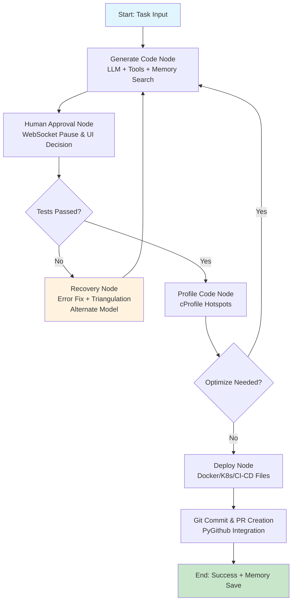

# CodeForge Agent

[](https://www.python.org/downloads/) [](https://opensource.org/licenses/MIT) [](https://docs.docker.com/compose/)

CodeForge Agent is an advanced AI-powered coding assistant that automates the full software development lifecycle: from generating code based on natural language tasks to testing, deploying, and creating GitHub Pull Requests. Built with [LangGraph](https://langchain-ai.github.io/langgraph/) for stateful workflows, it integrates LLMs (OpenAI/Anthropic), tools (web search, vision), Docker for sandboxing, and a real-time dashboard for monitoring and human-in-the-loop interaction.

Inspired by agentic AI best practices, it features error recovery with testing triangulation to minimize hallucinations, persistent memory via FAISS for learning from past tasks, and secure GitHub integration for automated PRs. Ideal for developers, teams, or CI/CD pipelines seeking autonomous code generation.

- **Key Stats**: 3206 LOC, 8 files, fully validated with Pydantic schemas.
- **Live Demo**: Run locally or deploy via Docker Compose.

## Features

- **AI-Driven Code Generation**: Uses GPT-4/Claude models with multi-modal support (e.g., analyze images/diagrams for code).
- **Automated Testing & Security**: Runs pytest, Bandit scans, and performance profiling (cProfile).
- **Deployment Automation**: Generates Dockerfiles, Kubernetes manifests, and GitHub Actions CI/CD pipelines.
- **Git Integration**: Creates branches, commits, and real PRs via PyGithub; falls back to local merges.
- **Memory & Learning**: FAISS vector store retrieves similar past tasks to improve outputs.
- **Error Recovery**: Intelligent fixes with alternate models and synthetic test validation.
- **Real-Time Monitoring**: Flask dashboard with WebSocket for state updates, metrics (Prometheus), and interactive approvals.
- **Tooling**: Built-in tools for web search, weather API, vector search, and image analysis.
- **Configurable**: YAML-based setup with Pydantic validation for LLMs, timeouts, Docker, etc.
- **Secure & Scalable**: JWT auth, Redis queues, containerized execution, and secret management (env/Vault).

For professional README best practices, see the [coding-boot-camp.github.io](https://coding-boot-camp.github.io/full-stack/github/professional-readme-guide/) guide, which emphasizes clear structure and Markdown mastery [guides.github.com](https://guides.github.com/features/mastering-markdown/).

## Architecture Overview

The agent uses a LangGraph state machine (`GraphState`) to orchestrate nodes in a loop: generate → approve → test → profile → deploy, with conditional routing for errors/recovery.



This flowchart visualizes the workflow, compatible with GitHub's native Mermaid rendering [expertbeacon.com](https://expertbeacon.com/how-to-add-diagrams-to-github-markdown-files-an-in-depth-guide-for-developers/). For editing diagrams in VS Code, use the Mermaid Chart plugin [docs.mermaidchart.com](https://docs.mermaidchart.com/blog/posts/mermaid-chart-vs-code-plugin-create-and-edit-mermaid-js-diagrams-in-visual-studio-code). Mermaid enhances READMEs for workflows/architectures [dev.to](https://dev.to/marciorc_/github-project-setup-markdown-tips-4kan).

## Quick Start

### Prerequisites
- Python 3.10+.
- Docker & Docker Compose [docs.docker.com](https://docs.docker.com/get-docker/).
- API Keys: OpenAI/Anthropic (for LLMs), GitHub (for PRs), optional Weather API.

### Installation
1. Clone the repo:
   ```
   git clone <your-repo-url>
   cd codeforge-agent
   ```

2. Install dependencies:
   ```
   pip install -r requirements.txt
   ```
   - For GPU acceleration: `pip install faiss-gpu torch` (if using local models).

3. Configure:
   - Copy `config.yaml.example` to `config.yaml` and edit (e.g., set `llm.default_provider: openai`, `github.owner: your-username`).
   - Set env vars: `export OPENAI_API_KEY=sk-...; export GITHUB_TOKEN=ghp-...; export JWT_SECRET_KEY=your-secret`.

4. Validate config:
   ```
   python -c "from schemas import validate_config; import yaml; print(validate_config(yaml.safe_load(open('config.yaml'))))"
   ```

### Running the Agent
1. Start services:
   ```
   docker-compose up -d  # Redis, optional Ollama for local LLMs
   ```

2. Run a task:
   ```
   python codeforge_agent.py "Build a simple Flask API for user authentication" \
     --dashboard --websocket --git-advanced --interactive --containerized
   ```
   - Flags: `--multi-modal --image path/to/diagram.png` for vision; `--sandbox-image python:3.11-slim`.
   - Output: JSON with generated files, success status, and costs. Sandbox in `/tmp/codeforge_*`.

3. Monitor:
   - Dashboard: [http://localhost:5000](http://localhost:5000) (logs, metrics, approve/reject pauses).
   - Metrics: [http://localhost:8000/metrics](http://localhost:8000) (Prometheus export).
   - WebSocket: Auto-connects for real-time events.

Example output:
```json
{
  "success": true,
  "files": {"app.py": "from flask import Flask\napp = Flask(__name__)\n..."},
  "iterations": 3,
  "total_cost": 0.045,
  "pr_url": "https://github.com/user/repo/pull/1"
}
```

For a README template with badges and sections, adapt from [gist.github.com](https://gist.github.com/PurpleBooth/109311bb0361f32d87a2).

## Usage Examples

- **Simple Code Gen**: `python codeforge_agent.py "Hello World in Python"`.
- **With Tools**: Auto-uses web search for facts (e.g., "API for weather in NYC").
- **Deployment**: Generates `Dockerfile`, `k8s.yaml`, and `.github/workflows/ci.yml`.
- **Interactive**: Pauses for review; respond via dashboard ("approve" or "reject with feedback").
- **Memory Test**: Run similar tasks twice—second iteration references the first.

Advanced: Integrate with CI/CD by piping tasks via `--ui_command_queue` for batch processing.

## Project Structure
```
codeforge-agent/
├── codeforge_agent.py     # Main agent & LangGraph workflow
├── schemas.py             # Pydantic config validation
├── github_manager.py      # GitHub PR integration
├── config.yaml            # Settings (LLM, Docker, etc.)
├── dashboard.html         # Web UI template
├── docker-compose.yml     # Services (Redis, Ollama)
├── requirements.txt       # Dependencies
└── README.md              # This file
```

## Contributing
1. Fork & clone.
2. Install dev deps: `pip install -r requirements.txt pytest`.
3. Run tests: `pytest` (add to `TestAgent`, lines 1574-1698).
4. Commit: Follow Conventional Commits; use `git commit -m "feat: add X"`.
5. PR: Create via GitHub; agent auto-reviews via integration.

See [dev.to](https://dev.to/marciorc_/github-project-setup-markdown-tips-4kan) for GitHub project setup tips, including Mermaid for PR diagrams.

## License
MIT License—see [LICENSE](LICENSE) for details.

## Acknowledgments
- Built on [LangChain/LangGraph](https://langchain-ai.github.io/langgraph/), [Pydantic](https://pydantic.dev/), [PyGithub](https://pygithub.readthedocs.io/), and [FAISS](https://faiss.ai/).
- Diagram rendering powered by Mermaid [mermaid.js.org](https://mermaid.js.org/).
- Thanks to open-source contributors for tools like Ollama and Redis.

For more on enhancing READMEs with diagrams, check [expertbeacon.com](https://expertbeacon.com/how-to-add-diagrams-to-github-markdown-files-an-in-depth-guide-for-developers/). Questions? Open an issue! 🚀
