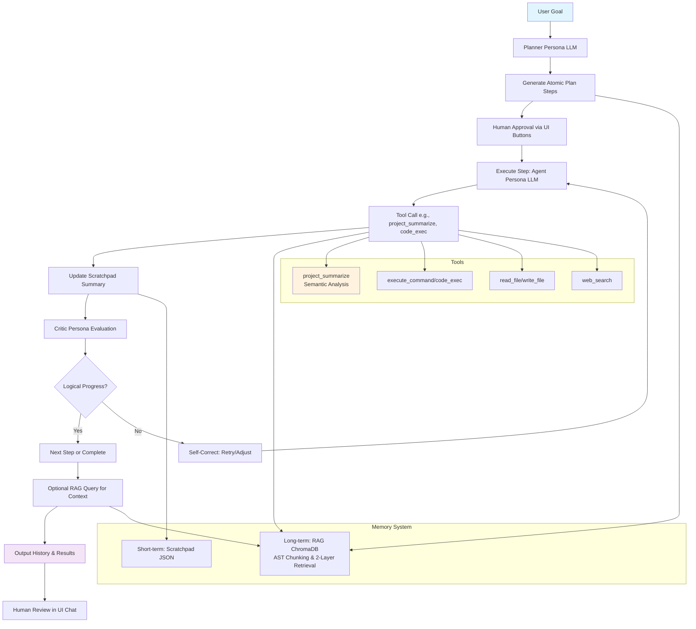

# Agentic Coder System

## Overview

The Agentic Coder is a stateful AI agent system designed for software development tasks. It features a reasoning engine powered by LangChain and OpenAI LLM, a suite of tools for file operations, code execution, web search, and semantic project analysis, short-term scratchpad memory, long-term RAG (Retrieval-Augmented Generation) with AST-aware chunking and two-layer retrieval using ChromaDB, and supervisory personas (Planner and Critic) for planning, execution, self-correction, and goal achievement.

The system is sandboxed to the project directory (`c:/sonoma/coder`) and includes a responsive web UI for human-in-the-loop interaction, served by the FastAPI backend. Developers can input goals, approve plans, monitor steps, query memory, and view outputs.

Key capabilities:
- **Stateful Reasoning**: Maintains context across multi-step tasks with scratchpad and RAG.
- **Tool Integration**: Atomic tools for common dev operations, including the new `project_summarize` for semantic code analysis.
- **Human-in-the-Loop UI**: Interactive interface with animations, onboarding, plan approval.
- **Self-Correction**: Critic persona evaluates actions and suggests corrections.

## Features

- **Reasoning Engine**: LLM-based planning and execution with personas (Planner breaks goals into atomic steps, Critic evaluates progress flexibly).
- **Tools** (registered in tools.py):
  - `read_file`: Read file content by relative path.
  - `write_file`: Write or append to files, creating directories if needed.
  - `execute_command`: Run shell commands in the workspace.
  - `web_search`: Basic web search (scraping; enhance with API).
  - `code_exec`: Safe Python code execution via subprocess with timeout.
  - `project_summarize`: Semantic project analysis for multiple languages (Python AST, JS/TS, Java, C/C++, Go, Rust, PHP, Ruby, SQL, HTML/CSS, JSON/YAML). Extracts classes/functions/imports/variables, docstrings, syntax errors with context, TODO/FIXME/HACK/NOTE tasks, semantic links (config keys to code usages), and stats (files, LOC, errors, todos, links). Input: directory path or .bin snapshot file; output: structured dict with analysis per file, global tasks/links, stats, file purposes.
- **Memory**:
  - Short-term: Scratchpad (file-based JSON) summarizes events post-step for concise working context (last 3 entries injected into prompts).
  - Long-term: RAG indexes code into ChromaDB (chunks functions/classes as units for Python, line-based for others; embeddings via OpenAI). Two-layer retrieval: semantic child chunks (top 50), re-rank parent files (top 3), add context window.
- **UI**: Responsive animated interface (HTML/CSS/JS) with gradient backdrop, fade-ins, loading spinners, hover effects, mobile-responsive. Sections: goal textarea, plan list with approve/reject buttons per step, chat-like output for execution, scratchpad refresh, RAG query input/result, onboarding modal for setup instructions.
- **Backend**: FastAPI server with CORS, serving API endpoints (/plan, /execute_step with approval, /scratchpad, /rag, /index, /run_full) and static UI files from /ui/ at /ui/index.html.

## Installation and Setup

### Prerequisites
- Python 3.8+.
- OpenAI API key (free tier sufficient for testing).

### Installation
1. Navigate to the project directory:
   ```
   cd c:/sonoma/coder
   ```

2. Install dependencies:
   ```
   pip install -r requirements.txt
   ```

3. Set up environment:
   - Create `.env` file in the root:
     ```
     OPENAI_API_KEY=sk-your-openai-api-key-here
     ```

4. Index the workspace for RAG (initial setup):
   ```
   python index_rag.py
   ```
   - This chunks and embeds all supported files (Python, JS, MD, TXT, JSON, YAML) into chroma_db/.

## Usage

### CLI Mode (Non-Interactive)
- Test the agent with a goal:
  ```
  python test_agent.py
  ```
  - Example goal: "Create a hello world script in Python."

- Run full goal programmatically:
  ```
  python -c "from agent import StatefulAgent; agent = StatefulAgent(); print(agent.run('Your goal here', max_steps=10))"
  ```

- Use project_summarize standalone:
  ```
  python -c "from summarizer import analyze_project; result = analyze_project(directory='.'); import json; print(json.dumps(result, indent=2))"
  ```
  - Analyzes current directory; outputs JSON with per-file summaries, tasks, links, stats.

### UI Mode (Human-in-the-Loop)
1. Start the backend server (serves API and UI):
   ```
   python app.py
   ```
   - Server runs on http://localhost:8000.
   - UI available at http://localhost:8000/ui/index.html (no separate server needed).

2. Open http://localhost:8000/ui/index.html in browser.

3. Follow onboarding modal:
   - Enter goal (e.g., "Refactor the agent.py to improve error handling").
   - Click "Generate Plan" to get atomic steps.
   - Review plan list; click "Run Next Step" or "Reject Step" for human approval.
   - Monitor execution in the chat output section.
   - Refresh scratchpad or query RAG for codebase context (e.g., "agent plan_goal method").
   - Use "Clear" for output, "Help" to re-show onboarding.

4. For auto-run (no approval):
   - Use curl: `curl -X POST http://localhost:8000/run_full -H "Content-Type: application/json" -d '{"goal": "Your goal"}'`

### Usage Examples

#### CLI Example (With New Tool)
```python
from agent import StatefulAgent
agent = StatefulAgent()
result = agent.run("Use project_summarize on the current directory to identify key structures and create a report.md file with the summary.")
print(result)  # Agent will summarize, then write report
```

#### UI Example
- Goal: "Add a new tool for database connection."
- Plan: 1. Summarize current tools. 2. Define input schema. 3. Implement function. 4. Add to registry.
- Approve step 1 (uses project_summarize internally if needed).
- View output in chat, RAG for "tools.py registry".

#### Project Summarizer Details
- **Input**: Directory (analyzes all supported files) or .bin snapshot (custom format with ##FILE: path: content).
- **Output**: JSON dict with:
  - `analysis_results`: Per-file list of structures (type, name, docstring, lines).
  - `tasks`: List of TODO/FIXME entries (file, line, comment).
  - `semantic_links`: Dict of file to links (e.g., config key to code entity).
  - `stats`: Total files, LOC, errors, todos, links.
  - `file_purpose`: Heuristic purpose per file (e.g., "Class/module definition").
- Example: Analyzed this project: 15 files, 2764 LOC, 0 errors, 4 docstring "tasks", no links.

## Architecture



## Project Structure

```
c:/sonoma/coder/
├── config.py                 # LLM/API config, paths
├── prompts.py                # Persona prompts with guardrails
├── tools.py                  # Pydantic tools & registry (6 tools incl. project_summarize)
├── memory.py                 # Scratchpad & LongTermMemory (RAG/Chroma integration)
├── summarizer.py             # Semantic analysis logic (multi-language, tasks, links)
├── rag/
│   ├── chunker.py            # Code-aware chunking (AST for Python)
│   └── retriever.py          # Two-layer retrieval (chunks to files)
├── agent.py                  # StatefulAgent: plan, execute, criticize, run loop
├── index_rag.py              # Index workspace for RAG
├── app.py                    # FastAPI backend: API + static UI serve
├── test_agent.py             # Agent test script
├── requirements.txt          # Dependencies (langchain, openai, fastapi, etc.)
├── .env                      # API key
├── README.md                 # This documentation
└── ui/                       # UI static files (served at /ui/)
    ├── index.html            # UI layout (goal, plan, output, memory)
    ├── styles.css            # Responsive CSS with animations
    └── app.js                # JS for API calls, human loop, updates
```

## Contributing

1. Fork the repo.
2. Create branch (`git checkout -b feature/summarizer-enhance`).
3. Commit (`git commit -m 'Enhance summarizer for new languages'`).
4. Push (`git push origin feature/summarizer-enhance`).
5. Open PR.

## License

MIT License. See LICENSE for details.

## Contact

Built by Roo AI. Report issues on GitHub.
