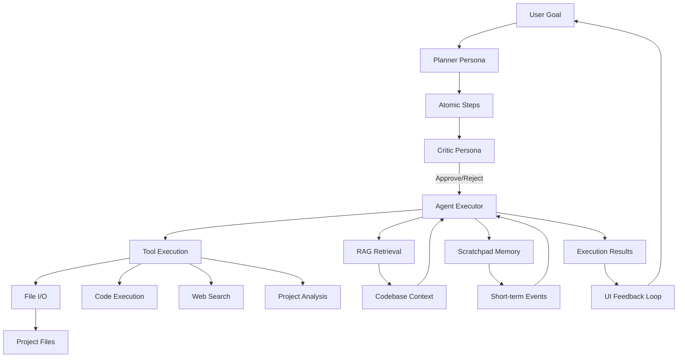

# Agentic Coder

Agentic Coder is a stateful AI coding assistant that helps you plan, execute, and manage software development tasks. It uses advanced agentic workflows with multiple personas (Planner, Critic, Agent) and integrates with OpenRouter for dynamic LLM model selection. The system provides both CLI tools for scripting and a modern web UI for interactive human-in-the-loop development.

## Features

- **Multi-Persona Architecture**: Planner breaks down goals, Critic reviews steps, Agent executes tasks
- **Dynamic LLM Integration**: Switch between OpenRouter models (free/paid) on-the-fly
- **Comprehensive Tooling**: File operations, code execution, web search, project analysis, RAG retrieval
- **Memory System**: Short-term scratchpad + long-term RAG for codebase context
- **Human-in-the-Loop UI**: Responsive web interface for plan approval and step execution
- **Multi-language Support**: Python, JavaScript, Java, C++, Go, Rust, PHP, Ruby, SQL, HTML/CSS analysis
- **Sandbox Security**: All operations confined to configurable project directory
- **Semantic Code Analysis**: AST parsing, TODO extraction, semantic linking, error detection

## Architecture Overview



## Installation

### Prerequisites
- Python 3.8+
- OpenRouter API key (free tier available)
- Node.js (optional, for UI development)

### Setup Steps

1. **Clone and Navigate**
   ```bash
   git clone <repository>
   cd sonoma-dusk-coder
   ```

2. **Configure Environment**
   Copy the example env file and add your OpenRouter API key:
   ```bash
   cp .env .env.local
   # Edit .env.local with your OPENROUTER_API_KEY
   ```

3. **Install Dependencies**
   ```bash
   pip install -r requirements.txt
   ```

4. **Index Project (Optional)**
   For RAG functionality, index your codebase:
   ```bash
   python index_rag.py
   ```

5. **Configure Project Directory**
   Edit `config.py` to set `PROJECT_DIR` to your target workspace:
   ```python
   PROJECT_DIR = r'/path/to/your/project'
   ```

## Usage

### CLI Usage

#### Test Agent
Run a simple test to verify installation:
```bash
python test_agent.py
```

#### Index Codebase
Build RAG index for your project:
```bash
python index_rag.py
```

#### Run Backend Server
Start the FastAPI server with web UI:
```bash
python app.py
```
Access at `http://localhost:8000/ui/index.html`

### Web UI Usage

1. **Start the System**
   ```bash
   python app.py
   ```

2. **Open UI**
   Navigate to `http://localhost:8000/ui/index.html`

3. **Select Model**
   - Choose from available OpenRouter models
   - Filter by free models if desired
   - Click "Start Coding"

4. **Define Goal**
   Enter your coding objective in natural language:
   ```
   Create a REST API for user management with JWT authentication
   ```

5. **Generate Plan**
   Click "Generate Plan" to see AI-generated execution steps

6. **Human-in-the-Loop**
   - Review each step
   - Approve/reject individual steps
   - Or run the full plan automatically

7. **Monitor Progress**
   - Watch real-time execution in the output chat
   - Query codebase context using RAG
   - Track short-term memory in scratchpad

### API Usage

The backend exposes REST endpoints for programmatic access:

```bash
# Get available models
curl http://localhost:8000/api/models?free_only=true

# Generate plan
curl -X POST http://localhost:8000/api/plan \
  -H "Content-Type: application/json" \
  -d '{"goal": "Create hello world app", "model": "openai/gpt-4"}'

# Execute step
curl -X POST http://localhost:8000/api/execute_step \
  -H "Content-Type: application/json" \
  -d '{"step_id": 1, "approve": true}'

# Query RAG
curl -X POST http://localhost:8000/api/rag \
  -H "Content-Type: application/json" \
  -d '{"query": "authentication logic"}'
```

## Examples

### Example 1: Simple Script Creation
**Goal**: "Create a Python script that fetches weather data from an API"

**Expected Plan**:
1. Research weather API endpoints and authentication
2. Create API configuration file with API key
3. Implement HTTP client for API requests
4. Add data parsing and error handling
5. Create main execution function
6. Add command line interface
7. Test with sample location

### Example 2: Web Application Setup
**Goal**: "Set up a React frontend with TypeScript and Tailwind CSS"

**Expected Tools Used**:
- `write_file`: Create `package.json`, `tsconfig.json`
- `execute_command`: Run `npm install`, `npm run dev`
- `project_summarize`: Analyze existing project structure
- RAG retrieval for React/TypeScript best practices

### Example 3: Code Refactoring
**Goal**: "Refactor the authentication module to use async/await"

**Memory Integration**:
- Scratchpad tracks refactoring progress
- RAG retrieves existing auth code context
- Critic persona reviews each refactored function

## Project Structure

```
sonoma-dusk-coder/
├── config.py                 # Configuration (API keys, paths)
├── prompts.py               # Persona prompt templates
├── summarizer.py            # Multi-language code analysis
├── tools.py                 # 6 core development tools
├── memory.py                # Scratchpad + RAG memory system
├── agent.py                 # StatefulAgent with personas
├── rag/
│   ├── chunker.py          # AST-based code chunking
│   └── retriever.py        # Two-layer RAG retrieval
├── app.py                   # FastAPI backend + API endpoints
├── index_rag.py            # RAG indexing script
├── test_agent.py           # Agent testing script
├── ui/
│   ├── index.html          # Main UI
│   ├── styles.css          # Responsive styles + animations
│   └── app.js              # Frontend JavaScript
├── .env                     # Environment variables
└── requirements.txt        # Python dependencies
```

## Tools Overview

### Core Tools (6 Total)

1. **read_file** - Read file contents from project directory
2. **write_file** - Create/modify files with append/overwrite options  
3. **execute_command** - Run shell commands in sandboxed environment
4. **web_search** - Google search scraping for research
5. **code_exec** - Safe Python code execution (restricted globals)
6. **project_summarize** - Semantic analysis across multiple languages

### Memory System

- **Scratchpad**: JSON-based short-term memory with LLM summarization
- **RAG**: Chroma vector store with AST chunking for Python, line-based for others
- **Retrieval**: Two-layer similarity search with parent context extraction

## Contributing

### Development Setup

1. **Install Development Dependencies**
   ```bash
   pip install -r requirements.txt
   # For UI development (optional)
   npm install --save-dev eslint prettier
   ```

2. **Run with Auto-reload**
   ```bash
   uvicorn app:app --reload --port 8000
   ```

3. **Test Changes**
   ```bash
   # Run tests
   python test_agent.py
   
   # Test RAG indexing
   python index_rag.py
   
   # Verify API endpoints
   curl http://localhost:8000/api/models
   ```

### Adding New Tools

1. Create Pydantic input model in `tools.py`
2. Implement tool function with sandboxing
3. Add to `TOOLS` dictionary
4. Update agent tool binding in `agent.py`

### Customizing Prompts

Modify persona templates in `prompts.py`:

```python
PLANNER_PROMPT = """
You are the Planner persona... {custom_instructions}
"""
```

### Model Integration

The system supports any OpenRouter-compatible model. Add custom models:

```python
# In config.py
LLM_MODEL = "your/custom/model"
```

## Security & Sandboxing

### Project Isolation
- All file operations confined to `PROJECT_DIR`
- Code execution uses restricted globals (`{"__builtins__": {}}`)
- Shell commands run in project directory with 30s timeout
- No network access outside web_search tool

### Configuration Security
- API keys loaded from `.env` (gitignored)
- Project directory configurable but validated
- Error messages sanitized for sensitive data

### Rate Limiting
- Tool execution includes timeouts
- LLM calls respect `MAX_TOKENS` limits
- Web search limited to top 5 results

## Troubleshooting

### Common Issues

1. **"No API key found"**
   ```bash
   # Check .env file
   cat .env.local
   # Should contain: OPENROUTER_API_KEY=sk-or-...
   ```

2. **"Failed to load models"**
   - Verify OpenRouter API key validity
   - Check network connectivity
   - Ensure `LLM_BASE_URL` is correct

3. **"File not found" errors**
   - Verify `PROJECT_DIR` path in `config.py`
   - Ensure target files exist in project directory
   - Check file permissions

4. **RAG indexing fails**
   ```bash
   # Run manually to see detailed errors
   python index_rag.py
   # Check Chroma DB path permissions
   ls -la chroma_db/
   ```

### Debugging

Enable verbose logging by setting environment variables:

```bash
export LOG_LEVEL=DEBUG
python app.py
```

### Performance Optimization

For large codebases:

1. **Selective Indexing**
   ```python
   # In memory.py, modify file filtering
   if filename.endswith(('.py', '.js', '.ts')):  # Only key languages
   ```

2. **Chunk Size Tuning**
   ```python
   # In rag/chunker.py
   self.chunker = CodeChunker(chunk_size=2000, chunk_overlap=400)
   ```

3. **Model Selection**
   Use smaller models for planning, larger for complex execution:
   ```javascript
   // In UI, select appropriate model per task
   modelSelect.value = taskComplexity > 5 ? 'gpt-4' : 'gpt-3.5-turbo';
   ```

## License

This project is licensed under the MIT License - see the [LICENSE](LICENSE) file for details.

### Open Source Notice

Agentic Coder builds upon:
- [LangChain](https://github.com/langchain-ai/langchain) - LLM orchestration
- [FastAPI](https://github.com/tiangolo/fastapi) - Web framework
- [ChromaDB](https://github.com/chroma-core/chroma) - Vector storage
- [OpenRouter](https://openrouter.ai) - LLM hosting

Special thanks to the open source community for enabling AI-powered development tools.

---

**Ready to build?** 🚀

Start your first project:
```bash
cd your-project-directory
ln -s ../sonoma-dusk-coder/config.py .
python ../sonoma-dusk-coder/index_rag.py
python ../sonoma-dusk-coder/app.py
```

Then open `http://localhost:8000/ui` and let the agentic coding begin!
